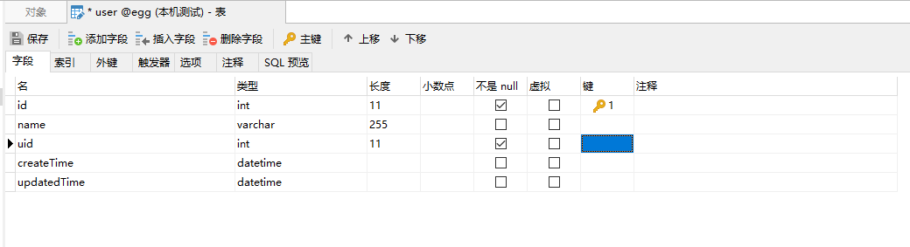
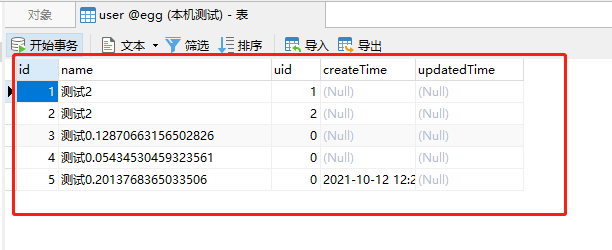

> Sequelize.JS是node里面比较常用的一个ORM(对象映射模型)，提供了很多丰富的接口，egg-sequelize是基于其做的一个egg项目下的ORM插件

### 安装

安装`egg-sequelize`、`mysql2`，也是[官方推荐](https://eggjs.org/zh-cn/tutorials/sequelize.html)

```bash
npm install --save egg-sequelize mysql2
```

### 配置

在`config/plugin.js`下，添加以下代码，说明开启该插件

```bash
exports.sequelize = {
    enable: true,
    package: 'egg-sequelize'
}
```

在`config/config.xxx.js`中,配置mysql
更多详细配置[使用EggJS开发接口（二）使用数据库之egg-sequelize](https://www.cnblogs.com/crazycode2/p/12445929.html)

```js
module.exports = {
    sequelize: {
        dialect: 'mysql',
        host: '127.0.0.1',
        port: 3306,
        username: 'root2', // 数据库用户名
        password: '123456', // 数据库密码
        database: 'egg',
        define: { // model的全局配置
            timestamps: true, // 添加create,update,delete时间戳
            paranoid: false, // 添加软删除
            freezeTableName: true, // 防止修改表名为复数
            underscored: false // 防止驼峰式字段被默认转为下划线
        },
        timezone: '+8:00', // 由于orm用的UTC时间，这里必须加上东八区，否则取出来的时间相差8小时
    }
}
```

### 使用

#### 新建数据库表



#### 模型-model

在`app/model/user.js`，没有model文件，则新建

[egg结合sequelize--模型定义中去除 createAt、updateAt字段，驼峰](https://blog.csdn.net/qq_36850813/article/details/89641846)

```js
module.exports = app => {
    const {STRING, INTEGER} = app.Sequelize;
    const User = app.model.define('user', {
        id: {
            type: INTEGER,
            autoIncrement: true,
            primaryKey: true
        },
        name: {
            type: STRING,
            allowNull: false //不允许为null
        },
        uid: {
            type: INTEGER
        },
    }, {
        createdAt: 'createTime', // 指定名字
        updatedAt: false,
    })
    return User;
}
```

#### 控制器-controller

在`app/controller/home.js`，添加一个方法

```js
module.exports = {
    async addUser() {
        const {ctx} = this;
        console.log(ctx.model.User)
        const result = await ctx.model.User.create({
            name: '测试' + Math.random(),
            pid: 99,
        });
        console.log(result)
    }
}
```

#### 路由-router

在`app/router.js`,添加一个路由

```js
router.get('/user/addUser', controller.home.addUser);
```

#### 测试

> 浏览器输入 http://127.0.0.1:7001/user/addUser

打开数据查看，已经多出几条数据



### 更多教程

>讲解基础的增删改查[Sequelize egg使用分享](https://juejin.cn/post/6844903983199305736#heading-2)

[Node.Js 搭建简单的 EggJs 示例项目](https://www.cnblogs.com/sochishun/p/14337564.html)


[Sequelize 中文文档](https://www.sequelize.com.cn/)