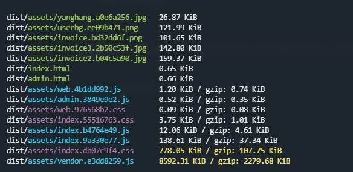

> 使用vite构建打包项目以及依赖包

> 当前vite版本2.6.10

### 问题

!>warnings when minifying css ,warning: "@charset" must be the first rule in the file @charset "UTF-8"

解决方式：

```js
build:{
    minify:false
}
```

具体请看[issues](https://github.com/element-plus/element-plus/issues/3219#issuecomment-960374776)

### 构建包的非常大



解决方式：

代码分割`manualChunks`

```js
export default {
    build: {
        output: {
            manualChunks: {
                "vxe-table": ["vxe-table"],
                "echarts": ["echarts"],
                "xe-utils": ["xe-utils"],
                "lodash": ['lodash'],
                "ant-design-vue": ['ant-design-vue']
            }
        }
    }
}
```

#### 开启压缩

```bash
npm i vite-plugin-compression -D
```

```js
import viteCompression from 'vite-plugin-compression'

export default {
    plugins: [
        viteCompression() // 添加插件执行即可
    ]
}
```

nginx 开启解压

```nginx
 gzip on;
```