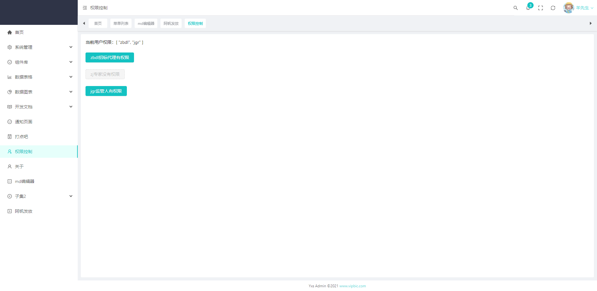

### 使用方式

```vue
<p v-auth="['client']">admin权限控制html标签是否展示</p>
<a-button type="primary" v-auth="['admin']">admin管理员权限</a-button>
<a-button type="primary" v-auth="['test']">test测试人员权限</a-button>
<a-button type="primary" v-auth="['client']">client客户使用人员权限</a-button>
<a-button type="primary" v-auth="['editor']">editor可编辑人员权限</a-button>
```



### v-auth指令

```js
import {App, Directive, DirectiveBinding} from 'vue'
import store from "@/packages/store";


const isButton = (el: Element) => {
    return el.tagName.toLowerCase() === 'button';
}

// 权限指令
function handlePermission(el: Element, binding: DirectiveBinding) {
    const {value, arg} = binding;
    if (value && value instanceof Array) {
        const roles = store.getters['user/roles'];
        const hasPermission = roles.some((role: any) => {
            return value.includes(role)
        })

        if (!hasPermission && arg) {
            return el.parentNode && el.parentNode.removeChild(el) // 条件不成立删除
        }

        if (!hasPermission) {
            if (isButton(el)) {
                el.classList.add('ant-btn-dashed');
                el.setAttribute("disabled", 'disabled');
            } else {
                el.parentNode && el.parentNode.removeChild(el)
            }
        }
    } else {
        console.error('权限控制使用例子 v-auth="[\'admin\',\'editor\']"')
    }
}

const permission: Directive = {
    // 指令绑定元素挂载前
    beforeMount(el: Element, binding: DirectiveBinding) {

    },
    // 指令绑定元素挂载后
    mounted(el: Element, binding: DirectiveBinding) {
        handlePermission(el, binding)
    },
    // 指令绑定元素因为数据修改触发修改后
    updated(el: Element, binding: DirectiveBinding) {
        handlePermission(el, binding)
    },
    // 指令绑定元素销毁前
    beforeUnmount(el: Element, binding: DirectiveBinding) {

    },
    // 指令绑定元素销毁后
    unmounted(el: Element, binding: DirectiveBinding) {

    }
}

const setupPermission = (app: App) => {
    app.directive('auth', permission)
}

export default setupPermission
```