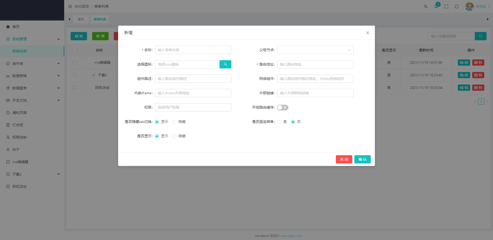
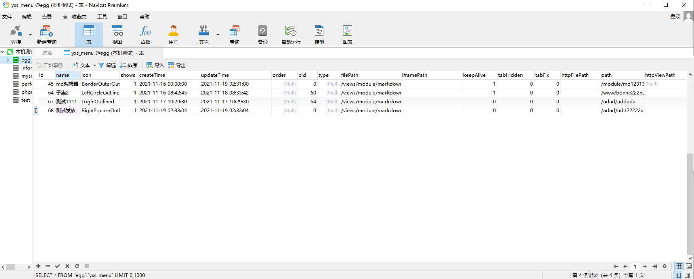

> 文件路径在`src/packages/views/sys`

### 添加菜单



前端表单字段名称

```ts
interface FormState {
    name: string;
    icon?: string,
    path?: string,
    filePath?: string,
    httpFilePath?: string,
    iframePath?: string,
    httpViewPath?: string,
    pid?: string | number,
    keepAlive?: number | string,
    tabHidden?: number | string,
    tabFix?: number | string,
    shows?: number | string
}
```

>字段介绍

#### name-名称

路由名称

#### icon-图标

显示菜单左侧的icon

#### path-路由名称

在浏览器地址栏url中展示的路由地址，比如：http://192.168.1.24:8290/#/home， `home`就是路由名称

#### filePath-路由文件路径

设置了路由名称后，如果不是iframe，或者外链那种，filePath指向的本地文件路径，比如：`src/web/views/category`

#### httpFilePath-网络文件组件

请求一个http网络组件，目前**还未实现**

#### iframePath-内嵌页面

设置一个http页面，用内嵌iframe打开

#### pid-父级id

如果设置了对应的pid，那么他父级就会变成目录

#### keepAlive-缓存

布尔值，设置是否缓存，注意页面组件需要设置name

#### tabHidden-隐藏

布尔值，设置是否在头部tab切换栏是否展示

#### tabFix-固定

布尔值，设置是否固定菜单，在头部tab栏上

#### shows-显示

布尔值，是否显示左侧菜单

### 数据库字段



```js
return app.model.define('menu', {
    id: {
        type: INTEGER,
        autoIncrement: true,
        primaryKey: true
    },
    name: {
        type: STRING,
        allowNull: false //不允许为null
    },
    icon: {
        type: STRING,
    },
    shows: {
        type: BOOLEAN,
        comment: '是否显示'
    },
    path: {
        type: STRING,
        comment: '路由名称'
    },
    httpViewPath: {
        type: STRING,
        comment: '外部链接'
    },
    order: {
        type: INTEGER,
        comment: '排序'
    },
    pid: {
        type: INTEGER,
        comment: '父级id'
    },
    type: {
        type: INTEGER,
        comment: '类型'
    },
    filePath: {
        type: STRING,
        comment: '文件路径'
    },
    iframePath: {
        type: STRING,
        comment: 'iframe路径'
    },
    keepAlive: {
        type: BOOLEAN,
        comment: '是否缓存'
    },
    tabHidden: {
        type: BOOLEAN,
        comment: '是否隐藏tab路由'
    },
    tabFix: {
        type: BOOLEAN,
        comment: '是否固定菜单路由'
    },
    httpFilePath: {
        type: STRING,
        comment: '网络组件'
    },
    createTime: {
        type: DATE,
        comment: '创建时间',
        get() {
            return dayjs(this.getDataValue('createTime')).format('YYYY/MM/DD HH:mm:ss');
        }
    },
    updateTime: {
        type: DATE,
        comment: '更新时间',
        get() {
            return dayjs(this.getDataValue('updateTime')).format('YYYY/MM/DD HH:mm:ss');
        }
    }
}, {
    createdAt: 'createTime', // 指定名字
    updatedAt: 'updateTime',
    tableName: 'yxs_menu' // 定义实际表名
});
```


